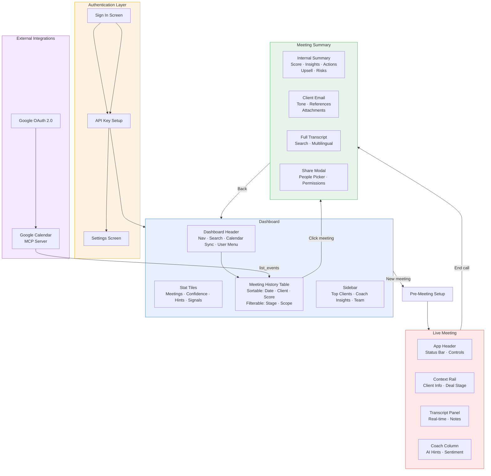
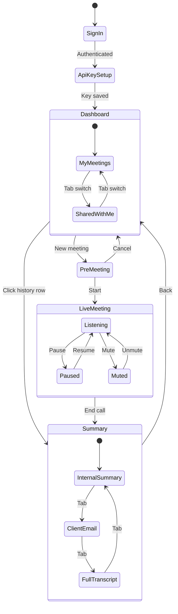
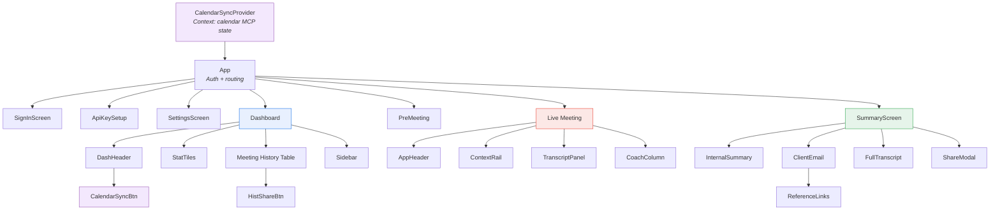
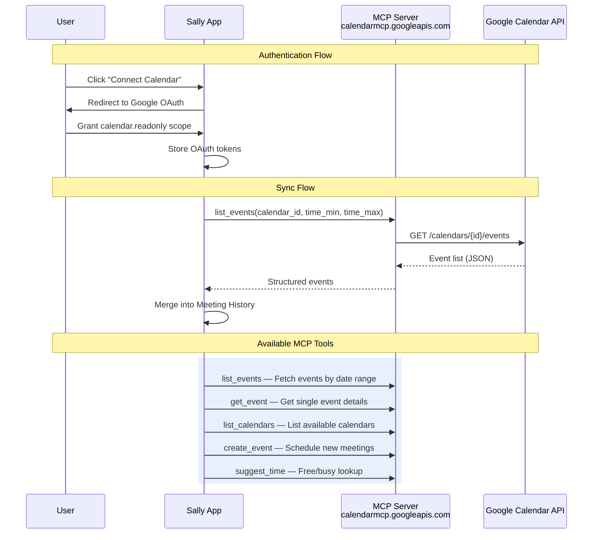
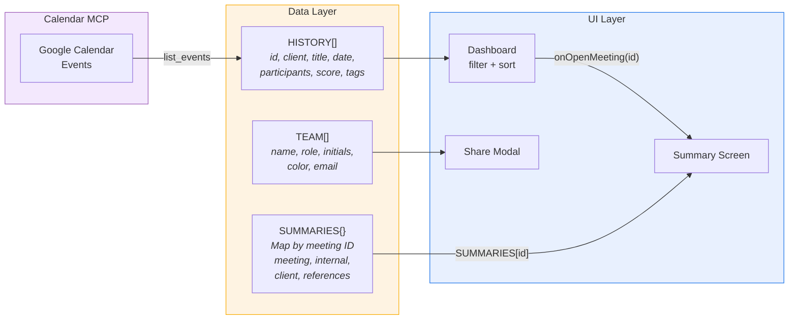

# Sally — SuperCloud Sales Coach

An AI-powered real-time sales coaching platform that provides live meeting assistance, post-meeting summaries, and team collaboration tools for cloud sales engineers.

---

## Architecture Overview

```
┌─────────────────────────────────────────────────────────────────────────┐
│                         SALLY — SALES COACH                           │
├─────────────────────────────────────────────────────────────────────────┤
│                                                                         │
│  ┌───────────┐   ┌───────────┐   ┌───────────┐   ┌───────────────────┐ │
│  │  Sign In  │──▶│  API Key  │──▶│ Dashboard │──▶│  Pre-Meeting      │ │
│  │  Screen   │   │  Setup    │   │           │   │  Setup            │ │
│  └───────────┘   └───────────┘   └─────┬─────┘   └────────┬──────────┘ │
│                                        │                   │            │
│                                        │                   ▼            │
│                                        │           ┌───────────────┐   │
│                                        │           │ Live Meeting  │   │
│                                        │           │  Coaching     │   │
│                                        │           └───────┬───────┘   │
│                                        │                   │            │
│                                        ▼                   ▼            │
│                                  ┌───────────────────────────────┐     │
│                                  │     Meeting Summary Page      │     │
│                                  │  ┌─────────┬────────┬──────┐  │     │
│                                  │  │Internal │Client  │Full  │  │     │
│                                  │  │Summary  │Email   │Trans.│  │     │
│                                  │  └─────────┴────────┴──────┘  │     │
│                                  └───────────────────────────────┘     │
│                                                                         │
└─────────────────────────────────────────────────────────────────────────┘
```

## Architecture Diagram (Mermaid)



## Screen Flow (Mermaid)



## Component Tree (Mermaid)



## Google Calendar MCP Integration (Mermaid)



## Data Flow (Mermaid)



---

## Screen Flow

```
                    ┌──────────────────────────────────────┐
                    │           USER FLOW                   │
                    └──────────────────────────────────────┘

    ┌──────────┐       ┌──────────┐       ┌──────────┐       ┌──────────┐
    │          │       │          │       │          │       │          │
    │  Auth &  │──────▶│Dashboard │──────▶│Pre-Meet  │──────▶│  Live    │
    │  Setup   │       │& History │       │  Setup   │       │ Meeting  │
    │          │       │          │       │          │       │          │
    └──────────┘       └────┬─────┘       └──────────┘       └────┬─────┘
                            │                                      │
                            │  Click meeting                       │  End
                            │  from history                        │  meeting
                            │                                      │
                            ▼                                      ▼
                       ┌──────────────────────────────────────────────┐
                       │              SUMMARY SCREEN                  │
                       │                                              │
                       │  ┌────────────┐ ┌──────────┐ ┌───────────┐  │
                       │  │  Internal  │ │  Client  │ │   Full    │  │
                       │  │  Summary   │ │  Email   │ │Transcript │  │
                       │  │            │ │  Draft   │ │           │  │
                       │  │ - Score    │ │          │ │ - Search  │  │
                       │  │ - Insights │ │ - Tone   │ │ - Multi-  │  │
                       │  │ - Actions  │ │ - Refs   │ │   lang    │  │
                       │  │ - Upsell   │ │ - Attach │ │           │  │
                       │  │ - Risks    │ │          │ │           │  │
                       │  └────────────┘ └──────────┘ └───────────┘  │
                       │                                              │
                       │  ┌──────────────────────────────────────┐    │
                       │  │         SHARE MODAL                  │    │
                       │  │  People picker · Permissions · Link  │    │
                       │  └──────────────────────────────────────┘    │
                       └──────────────────────────────────────────────┘
```

## Dashboard — Meeting History Table

```
┌──────────────────────────────────────────────────────────────────────────────┐
│  DASHBOARD                                                    [Calendar ↻]  │
├──────────────────────────────────────────────────────────────────────────────┤
│                                                                              │
│  ┌─ Stat Tiles ──────────────────────────────────────────────────────────┐   │
│  │  Meetings: 12   │  Avg Confidence: 82%  │  Hints: 68  │  Signals: 9 │   │
│  └───────────────────────────────────────────────────────────────────────┘   │
│                                                                              │
│  Meeting History                     [My meetings] [Shared]  [Search...]     │
│  ─────────────────────────────────────────────────────────────────────────   │
│  Client ▼  │ Meeting        │ Date ▼    │ People │ Stage  │ Tags │ Score ▼  │
│  ──────────┼────────────────┼───────────┼────────┼────────┼──────┼────────  │
│  ● Aviv    │ Vertex AI ...  │ Apr 24    │ ●●●    │ Disc.  │ 2    │  86     │
│  ● Rapyd   │ BigQuery ...   │ Apr 23    │ ●●●    │ Qual.  │ 3    │  72     │
│  ● Monday  │ GKE Autopilot  │ Apr 22    │ ●●●    │ Nego.  │ 3    │  91     │
│  ● Wix     │ AI infra       │ Apr 21    │ ●●     │ Intro  │ 2    │  64     │
│  ──────────┴────────────────┴───────────┴────────┴────────┴──────┴────────  │
│                                                                              │
│  ┌─ Sidebar ────────────────┐                                               │
│  │  Top clients             │                                               │
│  │  Coach insights          │                                               │
│  │  Team activity           │                                               │
│  └──────────────────────────┘                                               │
└──────────────────────────────────────────────────────────────────────────────┘
```

## Live Meeting Screen

```
┌──────────────────────────────────────────────────────────────────────┐
│  [SuperCloud]   Aviv Capital — Vertex AI Migration    🔴 LIVE 47:12 │
├──────────┬───────────────────────────────┬───────────────────────────┤
│          │                               │                           │
│ CONTEXT  │     LIVE TRANSCRIPT           │     COACH COLUMN          │
│  RAIL    │                               │                           │
│          │  Yael: "We're running on      │  ┌─ Hint ──────────────┐  │
│ Client   │   Bedrock — latency issues"   │  │ 💡 Ask about p95    │  │
│ info     │                               │  │    latency targets  │  │
│          │  Noa: "What range, p95?"       │  └─────────────────────┘  │
│ Deal     │                               │                           │
│ stage    │  Yael: "1.8 to 2.2 seconds"   │  ┌─ Follow-up ────────┐  │
│          │                               │  │ Regional endpoints  │  │
│ Prior    │  Daniel: "$38K/month on        │  │ europe-west4        │  │
│ meetings │   inference"                   │  └─────────────────────┘  │
│          │                               │                           │
│ Notes    │  ┌──────────────────────┐     │  📊 Sentiment: Positive  │
│          │  │ + Add note           │     │     ▁▂▃▅▆▇ trending up  │
│          │  └──────────────────────┘     │                           │
├──────────┴───────────────────────────────┴───────────────────────────┤
│  [⏸ Pause]  [🔇 Mute]  [🌐 EN/עב]                   [⏹ End call]  │
└──────────────────────────────────────────────────────────────────────┘
```

## Google Calendar MCP Integration

```
┌─────────────────────────────────────────────────────────────────┐
│                  GOOGLE CALENDAR MCP FLOW                       │
└─────────────────────────────────────────────────────────────────┘

  ┌──────────┐         ┌──────────────────┐         ┌────────────┐
  │          │  OAuth  │                  │  MCP     │  Google    │
  │  Sally   │◀──────▶│  MCP Server      │◀───────▶│  Calendar  │
  │  App     │  2.0   │  calendarmcp.    │  Tools   │  API       │
  │          │        │  googleapis.com  │         │            │
  └──────────┘         └──────────────────┘         └────────────┘
       │                       │
       │                       │
       ▼                       ▼
  ┌──────────┐         ┌──────────────────────────────────────┐
  │Dashboard │         │  Available MCP Tools:                │
  │ Meeting  │◀────────│                                      │
  │ History  │  events │  list_events    — Fetch by date      │
  │          │         │  get_event      — Event details      │
  └──────────┘         │  list_calendars — Available cals     │
                       │  create_event   — Schedule meetings  │
                       │  suggest_time   — Free/busy lookup   │
                       └──────────────────────────────────────┘

  Authentication:
  ┌─────────┐    ┌──────────┐    ┌───────────┐    ┌───────────┐
  │  User   │───▶│  Google  │───▶│  Token    │───▶│  MCP      │
  │  clicks │    │  OAuth   │    │  exchange │    │  requests │
  │  Connect│    │  consent │    │  & store  │    │  with     │
  │         │    │  screen  │    │           │    │  token    │
  └─────────┘    └──────────┘    └───────────┘    └───────────┘
```

## File Structure

```
sally/
├── GCP Sales Coach.html        # Entry point — loads all scripts
├── README.md
│
├── styles.css                  # CSS variables, tokens, base theme
├── app.css                     # Layout: topbar, main grid, panels
├── app2.css                    # Dashboard, history table, sidebar
├── hist-share.css              # History share popover, autocomplete
├── calendar-sync.css           # Google Calendar MCP panel styles
├── auth.css                    # Sign-in, API key, settings screens
├── screen-jump.css             # Dev flow navigation bar
├── references.css              # Reference links in email tab
│
├── data.js                     # Mock live meeting data (transcript, hints)
├── data-app.js                 # Meeting history, team, per-meeting summaries
│
├── icons.jsx                   # Inline SVG icon set (Ico.*)
├── tweaks-panel.jsx            # Dev/demo tweaks overlay
├── calendar-sync.jsx           # Google Calendar MCP integration layer
├── components-shell.jsx        # AppHeader, status bar
├── components-transcript.jsx   # Live transcript panel
├── components-coach.jsx        # AI coaching hints & sentiment
├── screen-auth.jsx             # Sign-in, API key setup, settings
├── screen-dashboard.jsx        # Dashboard + meeting history table
├── screen-premeeting.jsx       # Pre-meeting setup form
├── screen-summary.jsx          # Post-meeting summary (3 tabs + share)
├── app.jsx                     # Root App component, routing, state
│
├── assets/
│   └── supercloud-mark.svg     # Brand logo
├── screenshots/                # UI reference screenshots
└── uploads/                    # Pasted design references
```

## Component Architecture

```
CalendarSyncProvider                    (Context: calendar MCP state)
  └── App                              (Auth + routing)
        │
        ├── SignInScreen                (Google SSO)
        ├── ApiKeySetup                 (Gemini API key)
        ├── SettingsScreen              (User preferences)
        │
        ├── Dashboard                   (Main screen)
        │     ├── DashHeader            (Nav, search, CalendarSyncBtn, user menu)
        │     ├── StatTiles             (Weekly metrics)
        │     ├── Meeting History Table  (Sortable: date, client, score)
        │     │     └── HistShareBtn    (Per-row share popover)
        │     └── Sidebar               (Top clients, insights, team)
        │
        ├── PreMeeting                  (Client, agenda, template selection)
        │
        ├── Live Meeting
        │     ├── AppHeader             (Status bar, controls)
        │     ├── ContextRail           (Client context sidebar)
        │     ├── TranscriptPanel       (Real-time transcript + notes)
        │     └── CoachColumn           (AI hints, follow-ups, sentiment)
        │
        └── SummaryScreen               (Post-meeting)
              ├── InternalSummary       (Score, insights, actions, upsell)
              ├── ClientEmail           (Draft with tone/refs/attachments)
              ├── FullTranscript        (Searchable, multilingual)
              └── ShareModal            (People picker, permissions, link)
```

## Data Flow

```
┌────────────┐     ┌────────────┐     ┌──────────────┐
│  HISTORY   │────▶│  Dashboard │────▶│  Click row   │
│  (array)   │     │  Table     │     │  onOpenMeeting(id)
└────────────┘     └────────────┘     └──────┬───────┘
                                             │
                                             ▼
┌────────────┐     ┌────────────┐     ┌──────────────┐
│ SUMMARIES  │────▶│  Lookup by │────▶│ SummaryScreen│
│ (map by id)│     │  meeting ID│     │  (per-meeting│
└────────────┘     └────────────┘     │   data)      │
                                      └──────────────┘

Each meeting in HISTORY has:
  id, client, title, date, dateISO, time, duration,
  stage, score, sentiment, tags, participants[],
  hintCount, actedOn, nextStep, avatar

Each entry in SUMMARIES has:
  meeting{}, internal{}, client{}, references[]
```

## Features

- **Live AI Coaching** — Real-time hints, follow-up suggestions, and sentiment tracking during meetings
- **Meeting History** — Sortable table with date, participants, stage, score; filterable by stage and scope
- **Per-Meeting Summaries** — Internal analysis, client email draft, and full transcript for every meeting
- **Smart Sharing** — Share meetings with teammates via people picker with permission controls
- **Google Calendar MCP** — Sync meetings from Google Calendar via the MCP protocol
- **Multilingual** — English, Hebrew (RTL), and bilingual support
- **Dark Mode** — Full light/dark theme support

## Getting Started

1. Open `GCP Sales Coach.html` in any modern browser
2. The app runs entirely client-side — no build step or server required
3. Uses React 18 + Babel standalone for JSX transformation

## Tech Stack

- **React 18** — UI components (via CDN, no build)
- **Babel Standalone** — In-browser JSX compilation
- **CSS Custom Properties** — Theming and design tokens
- **Google Calendar MCP** — Meeting data sync via Model Context Protocol
